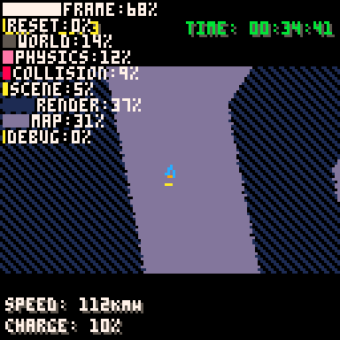

# Perfgraph for PICO-8

This is a super simple way to get a performance graph into your PICO-8 carts.



1. `#include perfgraph.lua`.
2. Use `p_start(name)` and `p_end(name)` around the code you need to measure.
3. Call `p_show(x,y,width)` to show a graph! (The frame times will reset after you call this.)

Full example:

```lua

#include perfgraph.lua

::l::

p_start("complicated 1")
for i=0,100 do
	circfill(rnd()*128,rnd()*128,rnd()*100,rnd()*16)
end
p_end("complicated 1")

p_start("complicated 2")
for i=0,100 do
	circ(rnd()*128,rnd()*128,rnd()*100,rnd()*16)
end
p_end("complicated 2")

p_show(1,1,32)

flip()

```

Have fun. You can find a demo in perfgraphdemo.p8 in this repo. If you like this then feel free to follow me on Twitter: [@btsherratt](http://twitter.com/btsherratt/).
